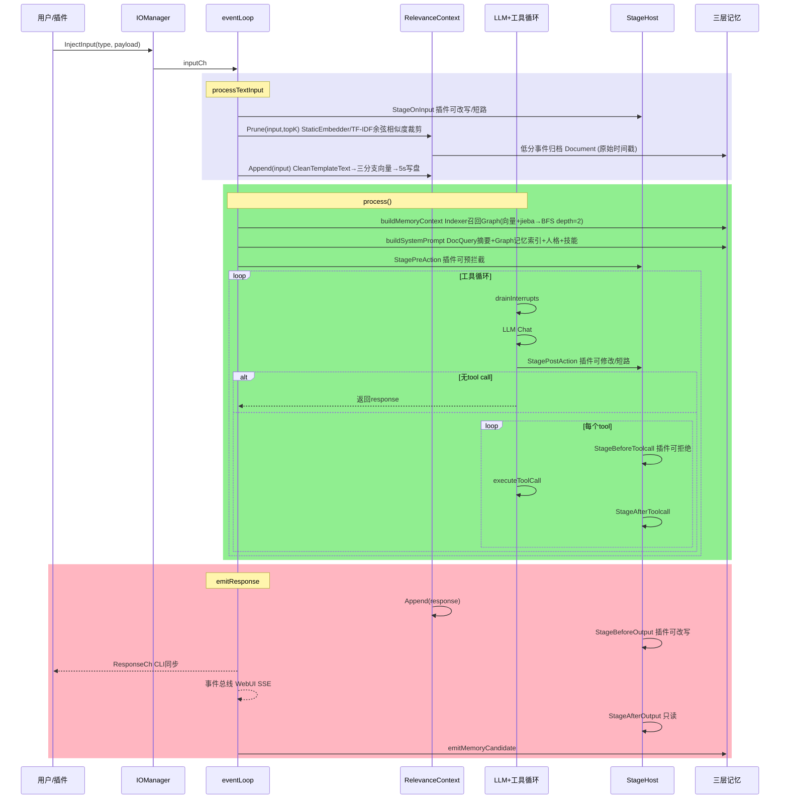
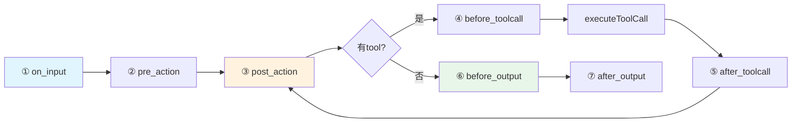
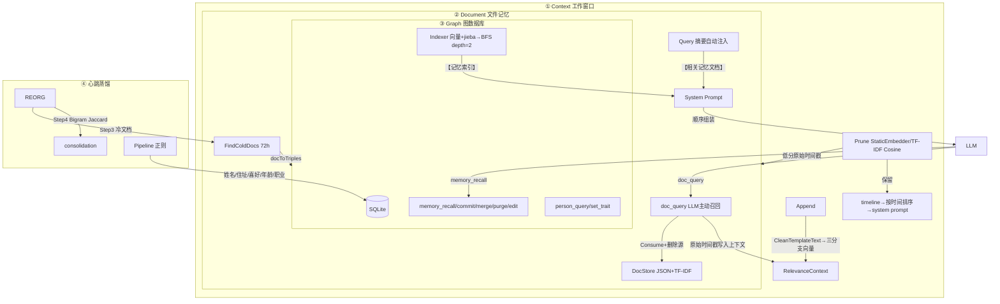

> ⚠️ **AI 辅助编程声明**：本项目代码、文档及提交历史中，部分内容由 AI 辅助生成或修改。人工已审阅关键改动，但使用时请自行评估与验证。

# HomeAgent

> **English**: [README_EN.md](./README_EN.md)

以**核心域与应用域分离**为设计原则的 Agent 框架。内核执行零 IO 策略——所有外部交互（WebUI、QQ、命令行、文件操作、网络搜索、备忘等）均由插件层承载，内核不直接处理任何 IO 操作。

配合**三层记忆架构**（Context → Document → Graph），通过分级存储与自动归档机制维持单会话长周期运行的上下文连贯性。

```go
homed（内核零 IO） ← PluginSDK → 插件（所有 IO 能力）
```

**v1.0.0 起外部插件是独立子进程**：经 stdio JSON-RPC（控制面）+ 共享内存段（数据面）+ 事件环（通知面）与内核通信。插件崩溃不影响内核且自动重启，换 `plugin.bin` 即生效的真热重载。

## 设计要点

**核心域与应用域分离** — 内核职责限定为 LLM 编排、记忆管理与知识检索；所有 IO 能力（消息收发、文件读写、网络请求、硬件交互等）由插件实现。这种划分在 Agent 框架层面进行领域边界界定，内核与插件各有其责任范围。

**三层记忆架构** — 通过分级存储策略管理 Agent 长期运行中的信息留存：

- **Context 层**：预训练词嵌入 / TF-IDF 回退的相关性评分事件窗口，保护最近 10 条，维护 topK 条上下文
- **Document 层**：临时记忆，冷数据自动下沉，也支持用户主动提交
- **Graph 层**：SQLite 图数据库，持久化实体关系和语义记忆，支持蒸馏管道从原始对话中提取三元组

## 架构图

### 一、消息处理时序



### 二、Stage 管道



### 三、三层记忆



详细说明见 [`assets/docs/zh/ARCHITECTURE.md`](assets/docs/zh/ARCHITECTURE.md)。

## 看板娘

<div align="center">
  
  <p><strong>小宅</strong> — HomeAgent 看板娘</p>
</div>

## 快速体验

```bash
make build build-cli
./build/homed -data /tmp/ha
```

```bash
# 交互模式
./build/waiter

# 或单条消息
echo "你好，记住我喜欢喝咖啡" | ./build/waiter
```

### 后台驻留模式（daemon）

waiter 也支持后台驻留，保持与 homed 的持久连接并等待 TUI 实例接入，适合让 agent 主动召唤用户/设备桥持续存活：

```bash
# 后台驻留（默认连 ~/.homeagent/cli.sock）
./build/waiter --daemon

# 指定 socket
./build/waiter --socket /path/to/cli.sock --daemon

# 随后任意 TUI/一行实例都会自动接入正在运行的 daemon，而不是直连 homed
./build/waiter
```

daemon 监听 `~/.homeagent/waiter.sock`，新客户端连入时会回放缓冲的最近对话（256 行），断连后 daemon 持续存活、自动重连 homed，并保持设备桥（若配置了 `device_gateway`/`device_token`）。

API 密钥通过 WebUI `http://localhost:8080` 设置页配置，持久化在 SQLite 中。

## 代码结构

```
cmd/homed/          守护进程入口，组装所有子系统
cmd/waiter/         CLI 客户端（Unix socket）
internal/
├── agent/core/     Agent 核心：事件循环、LLM 工具循环、7 阶段管道
├── agent/api/      LLM Provider + 8 个 Lua 适配器
├── memory/         三层记忆：Graph(SQLite) / Document(JSON+TF-IDF) / Text(JSONL) + StaticEmbedder(预训练词嵌入/TF-IDF回退) + CleanTemplateText(去模版)
├── knowledge/      知识库（文件系统 + TF-IDF）
├── plugin/         插件注册表 + 子进程加载器（stdio RPC + 共享内存段 + 事件环）
├── plugins/        内置 11 个插件（webui/cli/timer/cmd/mcp/clawhubadapter/agentcli/healthcheck/pluginmgr/files/cfgmgr）
├── sdk/            PluginSDK（Tool/Stage/Event 三通道）
├── config/         SQLite 配置中心
├── events/         事件总线
└── internal/lua/adapters/   8 个 LLM 协议适配器脚本
外部插件开发见 [homeagent-sdk](https://gitcode.com/JianFeeeee/homeagent-sdk) 仓库，使用 `plugindev` 工具链开发，参考 `example/` 目录下的 Go 和 Lua 示例
```

## 项目状态

**v1.0.3** — 内核 stage 协调器双重解锁修复。现网 homed 主进程曾一次 `fatal error: sync: unlock of unlocked mutex` 整体死亡（带走全部 27 个子进程插件）：`Host.endStage` 把「递减 inflight、判定最后离开者」放在 `coordMu` 临界区之外，而摘除协调器在临界区之内，于是后到插件能挂进一个正在收尾的协调器、被误判成最后离开者，对同一把 `stageMu` 解了两次。**`sync.Mutex` 双重解锁是 runtime fatal 而非 panic，两层 `recover` 结构上拦不住**，这才让「插件崩溃不拖垮内核」的隔离设计整体失效。修法是把计数、判定、摘除收进同一临界区，并把首进者写共享段的 `enter()` 也移入锁内（此前后到者可能读到写一半的段）。配套 5 个回归用例，含把旧实现 stash 回来验证测试确实能复现 fatal 的反向验证。

**v1.0.1** — 多模态 bugfix。插件 ABI/协议未变，1.0.0 编出的 `plugin.bin` 无需重编。修三类缺陷：（1）**看图假成功**——媒体块挂在 tool message 上不被模型当作可视内容（实测同一张图：tool message 0/3 读到、独立 user message 3/3），改为另起一条紧随其后的 user message 承载，落实插件文案一直在说的「注入后续对话」；（2）**新增多模态能力声明与回退链**——`core.llm.sources.<name>.vision/.audio` 声明源能否真正处理媒体（网关会静默剥离 `image_url` 后仍返回 200，带图与不带图 prompt_tokens 完全相同），不支持时自动走视觉源转写成文字，并落实了 `core.input_processing.image.fallback_provider` 这批早已注册却从未被读取的配置项；（3）**`see_video` 帧数语义反了**——`fps=1/N` 是频率不是数量，20s 视频请求 10 帧只得 2 帧、请求 1 帧反得 20 帧，改为 `ffprobe` 取时长 + `fps=N/时长` + `-frames:v` 硬封顶。

**v1.0.0** — 外部插件从 C ABI 动态库迁移到**子进程 + 共享内存**。首个不再加载 `.so`/`.dll` 的版本，与 0.9.x 不兼容（存量插件须用新版 `plugindev` 重编为 `plugin.bin`，**业务代码零改动**）。消除 6 类此前在生产造成故障的缺陷：热重载失效（`DF_1_NODELETE` 让 `dlclose` 成 no-op）、崩溃隔离缺失（插件 panic 带崩 homed）、stage lost update（副本模型丢失 35.8~36.8%）、cgo 超时不可中断（线程线性泄漏）、`output_send` 假成功（模型收到「已发送」而消息未送达）、Windows 能力断层（只见 3 个 stage 字段且无法写回）。三面通信：stdio JSON-RPC（控制）+ 共享内存段（数据）+ 事件环（通知）；权限梯度显式化为三道闸。RPC 往返 p50 24.1µs，崩溃到恢复 <1s。

**v0.9.0** — C ABI v2：外部插件 Stage 回调支持写回（`invoke_stage` 增加 result 输出，插件可在 OnInput/AfterToolcall/PostAction 修改 RawMessage/LLMText/ToolResults 等并同步回内核），ABI 版本随内核 minor 对齐（v0.9.x → ABIVersion=2，`version_min=1` 向后兼容旧插件）。同步修复工具循环 zen 兼容补位误伤首轮 system 上下文的问题。配套 SDK 提供增强版 sanitizer 示例（坏 UTF-8/U+FFFD/ANSI 转义全链路清洗）。**该 ABI 已随 v1.0.0 退场。**

**v0.8.0** — 核心可用，插件系统增强。内置 20+ 插件，外部插件开发见 [homeagent-sdk](https://gitcode.com/JianFeeeee/homeagent-sdk) 仓库。新增输入通道 `NoMemory`/`Cleaner`、`ChannelDef`、插件禁用/启用系统（CLI + WebUI），`plugindev` 工具链完成 C ABI `ChannelDef` 传递。

## 文档

- [项目概览](assets/docs/zh/OVERVIEW.md) | [English](assets/docs/en/OVERVIEW.md)
- [技术架构](assets/docs/zh/ARCHITECTURE.md) | [English](assets/docs/en/ARCHITECTURE.md)
- [插件开发指南](assets/docs/zh/PLUGIN_DEV.md) | [English](assets/docs/en/PLUGIN_DEV.md)
- [Lua Adapter](assets/docs/zh/ADAPTER.md) | [English](assets/docs/en/ADAPTER.md)
- [知识库演示](assets/knowledge/homeagent_architecture/content.md)

## 下载

[Releases](https://gitcode.com/JianFeeeee/HomeAgent/releases) 提供三种变体：

| 变体 | 内容 | 适用 |
|---|---|---|
| **full** | homed + waiter + 桌面 GUI + systemd unit | 单机全功能 |
| **server** | homed + waiter + systemd unit | 服务器（无桌面环境） |
| **client** | waiter + 桌面 GUI | 连接远程 HomeAgent |

- Linux：`.deb`（amd64/arm64）、`.rpm`（x86_64）、`.tar.gz`
- Windows：`HomeAgent_v1.0.3_{Full,Server,Client}_win64.exe`（NSIS 安装向导）
- 免安装：`homeagent-bin-<os>_<arch>.tar.gz`（含 homed/waiter/initconfig）
- 校验：`SHA256SUMS`

macOS 的 `homed` 需在原生 macOS 构建（CGO + sqlite3），发布包仅含 `waiter`/`initconfig`。

## 构建

```bash
make build build-cli    # 编译守护进程 + CLI
make test               # go test ./...
make install            # 安装到系统
```

依赖：Go 1.25+, CGo (go-sqlite3), Linux/Windows。
