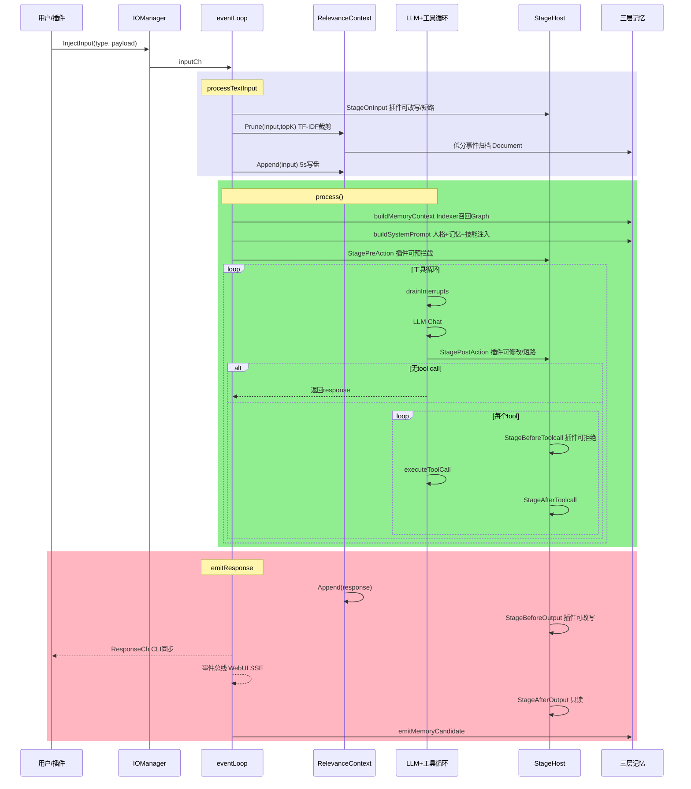
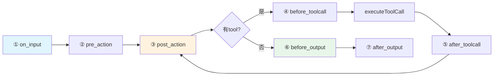
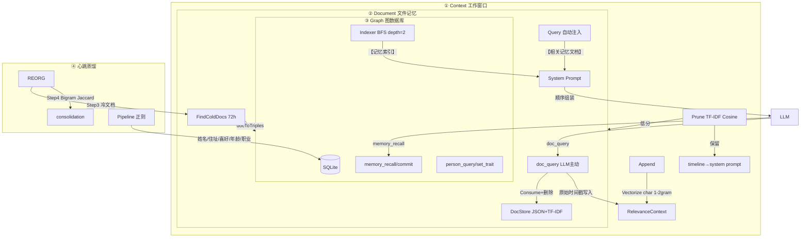

# HomeAgent

首个提出**核心域与应用域分离**的 Agent 框架。内核零 IO，一切外界交互由插件承载——WebUI、QQ、命令行、文件操作、网络搜索、备忘，全部是插件，内核不碰任何 IO。

配合**三层记忆架构**（Context → Document → Graph），单对话长期稳定运行，记忆不衰减。

```go
homed（内核零 IO） ← PluginSDK → 插件（所有 IO 能力）
```

## 核心创新

**核心域与应用域分离** — 内核只做 LLM 编排、记忆管理、知识检索；所有 IO 能力（收发消息、读写文件、网络请求、硬件交互）全由插件实现。插件可热加载、独立开发、独立发布。这不是 RPC 框架的微服务拆分，而是 Agent 框架层次的领域划分。

**三层记忆架构** — 解决 Agent 长期运行的记忆衰减问题：
- **Context 层**：TF-IDF 相关性评分的事件窗口，维护最近 topK 条上下文
- **Document 层**：临时记忆，冷数据自动下沉，也支持用户主动提交
- **Graph 层**：SQLite 图数据库，持久化实体关系和语义记忆，支持蒸馏管道从原始对话中提取三元组

## 架构图

### 一、消息处理时序



### 二、Stage 管道



### 三、三层记忆



详细说明见 [`docs/ARCHITECTURE.md`](docs/ARCHITECTURE.md)。

## 快速体验

```bash
make build build-cli
./build/homed -data /tmp/ha
```

```bash
# 交互模式
./build/waiter

# 或单条消息
echo "你好，记住我喜欢喝咖啡" | ./build/waiter
```

API 密钥通过 WebUI `http://localhost:8080` 设置页配置，持久化在 SQLite 中。

## 代码结构

```
cmd/homed/          守护进程入口，组装所有子系统
cmd/waiter/         CLI 客户端（Unix socket）
internal/
├── agent/core/     Agent 核心：事件循环、LLM 工具循环、7 阶段管道
├── agent/api/      LLM Provider + 8 个 Lua 适配器
├── memory/         三层记忆：Graph(SQLite) / Document(JSON+TF-IDF) / Text(JSONL)
├── knowledge/      知识库（文件系统 + TF-IDF）
├── plugin/         插件注册表 + .so 动态加载器
├── plugins/        内置 10 个插件（webui/cli/timer/cmd/mcp/openclaw/agentcli/healthcheck/pluginmgr/files）
├── internal/sdk/   PluginSDK（Tool/Stage/Event 三通道）
├── config/         SQLite 配置中心
├── events/         事件总线
└── lua/adapters/   8 个 LLM 协议适配器脚本
外部插件开发见 [homeagent-sdk](https://gitcode.com/JianFeeeee/homeagent-sdk) 仓库的 `example/` 目录
```

## 项目状态

核心可用，插件系统和 SDK 已就绪。内置 10 个插件，外部插件开发见 [homeagent-sdk](https://gitcode.com/JianFeeeee/homeagent-sdk) 仓库。

## 文档

- [项目概览](docs/OVERVIEW.md)
- [技术架构](docs/ARCHITECTURE.md)
- [插件开发指南](docs/PLUGIN_DEV.md)
- [Lua Adapter](docs/ADAPTER.md)
- [知识库演示](knowledge/homeagent_architecture/content.md)

## 构建

```bash
make build build-cli    # 编译守护进程 + CLI
make test               # go test ./...
make install            # 安装到系统
```

依赖：Go 1.19+, CGo (go-sqlite3), Linux。