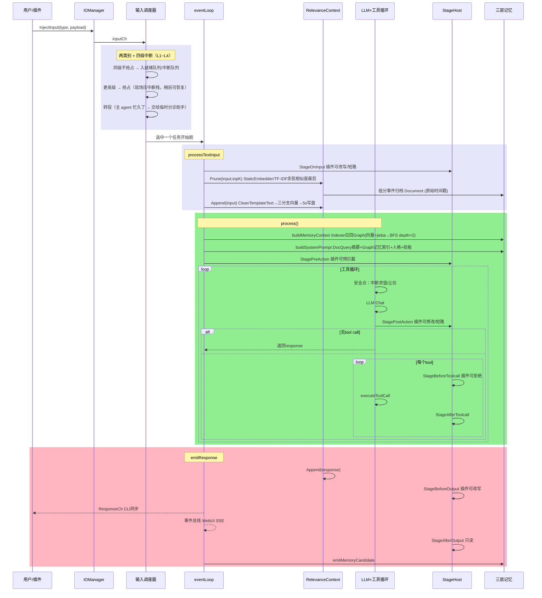
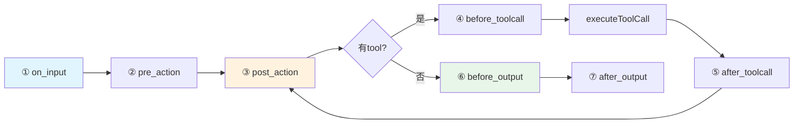
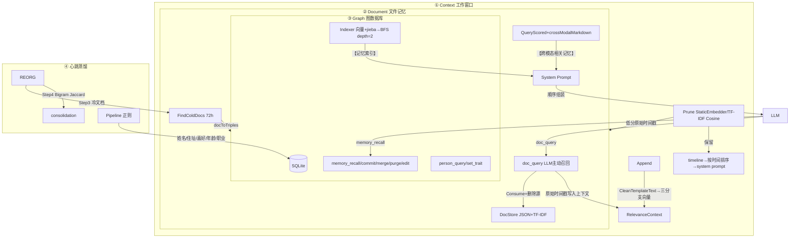

> ⚠️ **AI 辅助编程声明**：本项目代码、文档及提交历史中，部分内容由 AI 辅助生成或修改。人工已审阅关键改动，但使用时请自行评估与验证。

# HomeAgent

> **English**: [README_EN.md](./README_EN.md)

以**核心域与应用域分离**为设计原则的 Agent 框架。内核执行零 IO 策略——所有外部交互（WebUI、QQ、命令行、文件操作、网络搜索、备忘等）均由插件层承载，内核不直接处理任何 IO 操作。

配合**三层记忆架构**（Context → Document → Graph），通过分级存储与自动归档机制维持单会话长周期运行的上下文连贯性。

```go
homed（内核零 IO） ← PluginSDK → 插件（所有 IO 能力）
```

**v1.1.1 起媒体贯通插件边界**：插件与模型都能读写记忆里的图片/音频（`InsertWithMedia`、`InjectInputMedia`），媒体以 `[<mime> <短digest>] <描述>` 标记存在于纯文本记忆中——描述是可检索的语义记忆，digest 是回到字节的钥匙。

**v1.0.0 起外部插件是独立子进程**：经 stdio JSON-RPC（控制面）+ 共享内存段（数据面）+ 事件环（通知面）与内核通信。插件崩溃不影响内核且自动重启，换 `plugin.bin` 即生效的真热重载。

## 设计要点

**核心域与应用域分离** — 内核职责限定为 LLM 编排、记忆管理与知识检索；所有 IO 能力（消息收发、文件读写、网络请求、硬件交互等）由插件实现。这种划分在 Agent 框架层面进行领域边界界定，内核与插件各有其责任范围。

**三层记忆架构** — 通过分级存储策略管理 Agent 长期运行中的信息留存：

- **Context 层**：预训练词嵌入 / TF-IDF 回退的相关性评分事件窗口，保护最近 10 条，维护 topK 条上下文
- **Document 层**：临时记忆，冷数据自动下沉，也支持用户主动提交
- **Graph 层**：SQLite 图数据库，持久化实体关系和语义记忆，支持蒸馏管道从原始对话中提取三元组

**输入调度：两类别 + 四级中断** — 输入不直接进 LLM，先进调度器。
排队（待办工作）与中断（按"有多不能等"分 L1~L4）两类；高级可抢占低级并保存现场
（中断栈），同级不抢占。L4 只归内核与内核级插件（如 WebUI 终止按钮）。
见 [`assets/docs/zh/ARCHITECTURE.md`](assets/docs/zh/ARCHITECTURE.md) 的「输入调度器与中断机制」。

**驻留式子 agent** — 内核可派驻轻量内核的子 agent（自己的调度器与 temp 图记忆，
共享通道登记表），把长任务/积压交出去并行做。主 agent 忙久了，内核还会把排队输入
交给临时**分诊助手**：简单的直接处理，需要主 agent 的立刻回「忙碌中，请稍候」，
用户不再干等。见 [`docs/zh/resident-subagent-design.md`](docs/zh/resident-subagent-design.md)。

## 架构图

### 一、消息处理时序



### 二、Stage 管道



### 三、三层记忆



详细说明见 [`assets/docs/zh/ARCHITECTURE.md`](assets/docs/zh/ARCHITECTURE.md)。

## 看板娘

<div align="center">
  
  <p><strong>小宅</strong> — HomeAgent 看板娘</p>
</div>

## 快速体验

```bash
make build build-cli
./build/homed -data /tmp/ha
```

```bash
# 交互模式
./build/waiter

# 或单条消息
echo "你好，记住我喜欢喝咖啡" | ./build/waiter
```

### 后台驻留模式（daemon）

waiter 也支持后台驻留，保持与 homed 的持久连接并等待 TUI 实例接入，适合让 agent 主动召唤用户/设备桥持续存活：

```bash
# 后台驻留（默认连 ~/.homeagent/cli.sock）
./build/waiter --daemon

# 指定 socket
./build/waiter --socket /path/to/cli.sock --daemon

# 随后任意 TUI/一行实例都会自动接入正在运行的 daemon，而不是直连 homed
./build/waiter
```

daemon 监听 `~/.homeagent/waiter.sock`，新客户端连入时会回放缓冲的最近对话（256 行），断连后 daemon 持续存活、自动重连 homed，并保持设备桥（若配置了 `device_gateway`/`device_token`）。

API 密钥通过 WebUI `http://localhost:8080` 设置页配置，持久化在 SQLite 中。

## 代码结构

```
cmd/homed/          守护进程入口，组装所有子系统
cmd/waiter/         CLI 客户端（Unix socket）
internal/
├── agent/core/     Agent 核心：输入调度器（两类别+四级中断）、事件循环、LLM 工具循环、7 阶段管道、驻留子
├── agent/api/      LLM Provider（Lua 适配层：provider.go 调 vm）
├── memory/         三层记忆：Graph(SQLite) / Document(JSON+TF-IDF) / Text(JSONL) + StaticEmbedder(预训练词嵌入/TF-IDF回退) + CleanTemplateText(去模版)
├── knowledge/      知识库（文件系统 + TF-IDF）
├── plugin/         插件注册表 + 子进程加载器（stdio RPC + 共享内存段 + 事件环）
├── plugins/        内置 18 个插件（webui/cli/timer/cmd/mcp/files/cfgmgr/agentcli/healthcheck/pluginmgr/clawhubadapter/multimodal/remotedevice/ai_image/localuse/skillmgr/data 等）
├── sdk/            PluginSDK（Tool/Stage/Event 三通道）
├── config/         SQLite 配置中心
├── events/         事件总线
└── internal/lua/adapters/   10 个 LLM 协议适配器脚本
外部插件开发见 [homeagent-sdk](https://gitcode.com/JianFeeeee/homeagent-sdk) 仓库，使用 `hmapdev` 工具链开发，参考 `example/` 目录下的 Go 和 Lua 示例
```

## 项目状态

**v1.3.x 线**（v1.3.1–v1.3.12，最新已发布）—— **驻留式子 agent** + **输入调度器重做**。

- **驻留式子 agent**：内核可派驻轻量内核的子 agent（自己的调度器、自己的 temp 图记忆、
  共享通道登记表）。父经 `resident_agents`（list/create/send/inspect/compress/reclaim/destroy）
  派活与收活；inputch 可划给子，输入**在进内核之前**就已路由到子。
- **输出通道可寻址到具体 agent**：`AllowedOutputs` 授权集合（三处过滤点一致），
  父/子之间可互相投递；设备能力也 outputch 化（每设备一个 `device/<id>` 通道）。
- **输入调度器**：排队/中断两类别 + 四级中断（L1~L4）+ 抢占/挂起/恢复/中断栈；
  同级不抢占、有饥饿防护与抢占冷却；L4 只归内核与内核级插件（WebUI 终止按钮）。
- **轻量内核 profile**：子的记忆面收窄为「传统上下文 + 图记忆」（窄接口，
  主库以 query_only 受限句柄打开，写走自己的 temp 实例）。
- **积压及时反馈**（后续线）：主 agent 长时间忙时，内核把排队输入交给临时**分诊助手** ——
  简单的直接处理并回复，需要主 agent 的立刻回「忙碌中，请稍候」，用户不再干等十几分钟。
- 修掉一批真实缺陷：销毁驻留子时入站 inputch（`child/<id>`）注册残留、
  子的轮次永远显示 0（`info()` 根本没填）、子侧 childIO 空壳（未继承父的输出通道）、
  设备心跳 pong 忘了 Flush（每 60 秒掉线）、Lua 插件桥与 SDK 1.3.0 对齐。

**v1.2.0** — 统一多模态向量空间 + 媒体升为图记忆一等节点 + 数据面全量迁到共享内存。

- **模型中立的统一向量空间**：内核不再适配任何具体模型，只提供公共 provider SPI
  （`pkg/embedding`：`Modality` / `Input{Data,MIME}` / `Info{Dimension,Fingerprint,Modalities}`
  + 名字注册表），实现在 `providers/*`。默认 **Chinese-CLIP ViT-B/16** —— text 与 image
  落在**同一空间**（512 维、指纹 `cd2a495cf990`、Apache-2.0；实测加载峰值 1.59GB、静置回收后稳态约 0.89GB）；
  `qwen3vl` 保留（2048 维、常驻约 9.4GB，供内存充足或将来要视频的机器切回）。
  文本检索仍由既有词向量 / TF-IDF 兜底：CLIP 双塔的**纯文本语义弱于 MLLM 型嵌入器**，
  这是已知并写进文档的代价。
- **媒体是图数据库的一等节点与边**：**彻底删除**「用文本描述式索引图片」这套将就机制，
  以及 `media_refs` 与媒体引用计数。记忆块遵循单层不变量——Context → Document → Graph
  是块的**迁移**，不是复制、也不靠引用保活。
- **数据面全部走共享内存**（工具调用帧 / Cleaner / 输入输出通道 / 媒体块 / 文档与知识正文），
  RPC 只传偏移描述符；**RPC 协议升到 2**，fd3 布局改变，**不支持滚动升级**——
  内核与全部插件必须同批重建、同批安装，存量插件须用新版 `hmapdev` 重编。
- 注入可声明 `InjectOptions{NoMemory, ContextPolicy}`（**默认仍记入记忆、默认不裁剪**）；
  裁剪必须显式声明，且先经插件注册的 `Cleaner`。SDK 1.2.0 相对 1.1.0 **纯追加**。
- **发行包默认启用** ONNX 向量空间，并把模型（754MB）与 ONNX Runtime（24MB）随
  server/full 包发布；`homed` 放弃 Windows 原生支持改走 WSL2；jieba 词库内嵌进二进制。
- 修掉三个**安装链静默失败**：`initconfig` 因 `CGO_ENABLED=0` 是空操作（打印凭据却一个字节
  没写）、全新安装被误判「已有配置」而整体跳过默认值播种（装完 0 插件）、deb 的 `postinst`
  查错 unit 路径导致 `enable` 从未执行。
- 自本版起以 **AGPL-3.0-only** 发布（含网络条款；插件静态链接 SDK 故须同许可，见「许可」）。

> 以下历史条目保留原文以呈现演进，其中两条机制**已在 v1.2.0 移除**：
> 「媒体以 `[<mime> <短digest>] <描述>` 标记参与检索」（描述式索引）与「媒体引用计数式 GC」。
>
> 另有**两项性能断言的量纲需要更正**（2026-09-20 实测）：
> 「崩溃到恢复 <1s」不成立 —— 崩溃后是**线性退避重启**，即 1s / 2s / 3s（`procRestartBackoff=1s × 第 n 次`），
> 首次重启就要等 1s。且 5 分钟窗口内第 **4** 次崩溃即停止自动重启待人工介入（`procMaxRestarts=3`，判定为 `n > 3`）。
> 该断言写下时（v1.0.0）退避值已是 1s，故从未成立。
> 「RPC 往返 p50 24.1µs」与当前实测同量级但不吻合：本机 `BenchmarkToolInvoke` 实测
> inline/small **30.4µs**、frame/small 51.5µs、inline/large 767µs、frame/large 398µs。
> 保留原文不修改，以免伪造历史。

**v1.1.1** — 多模态贯通**插件边界**。v1.1.0 让记忆系统支持了二进制多媒体节点，但那条链路只对内核自己开放；本版打通到插件与模型。公开 SDK 新增媒体字段与三个媒体注入接口（配套 [SDK v1.1.0](https://gitcode.com/JianFeeeee/homeagent-sdk/releases/tag/v1.1.0)，整条 1.1.x 线共用），内核实现对应四个 RPC。桥接层此前在**静默裁字段**：插件交进来的 `Confidence`/类型/`SentenceText` 全被丢弃、`Doc` 只留三个字段、`Remove` 不解引用（媒体永久算「被引用」，GC 收不掉）。`processTextInput`/`processMediaInput` 归一成一条 `processInput`，媒体路径由此获得它一直缺的去重、`no_memory`、通道 `Cleaner`、中断语义、`EventRawInput`。修掉三处真实缺陷：**用户发的图从来没出现在 WebUI 聊天记录里**（媒体路径发布 map 而订阅方断言 string）、**`memory_commit` 的 `sentence_text` 从未暴露给模型**（而它是媒体绑定链的必经环节）、**`PluginSDK` 两处并发竞态**（`-race` 实测 11 处，插件重载瞬间偶发 nil 解引用崩溃）。

**v1.1.0** — 记忆系统支持**二进制多媒体节点**。内容寻址媒体存储（CAS + SQLite 元数据 + 磁盘 blob，`Get` always 重校 digest），贯通 L0（上下文事件）/L2（文档）/L3（图谱句子）三层，引用计数式 GC（有引用者绝不删）。视觉模型生成的描述文本是持久语义记忆，blob 只是可被容量 GC 淘汰的缓存。

**v1.0.0** — 外部插件从 C ABI 动态库迁移到**子进程 + 共享内存**。首个不再加载 `.so`/`.dll` 的版本，与 0.9.x 不兼容（存量插件须用新版工具链重编；该工具链当时名为 `plugindev`，**现名 `hmapdev`**）。外部插件需重编为 `plugin.bin`，**业务代码零改动**）。消除 6 类此前在生产造成故障的缺陷：热重载失效（`DF_1_NODELETE` 让 `dlclose` 成 no-op）、崩溃隔离缺失（插件 panic 带崩 homed）、stage lost update（副本模型丢失 35.8~36.8%）、cgo 超时不可中断（线程线性泄漏）、`output_send` 假成功（模型收到「已发送」而消息未送达）、Windows 能力断层（只见 3 个 stage 字段且无法写回）。三面通信：stdio JSON-RPC（控制）+ 共享内存段（数据）+ 事件环（通知）；权限梯度显式化为三道闸。RPC 往返 p50 24.1µs，崩溃到恢复 <1s。

**v0.9.0** — C ABI v2：外部插件 Stage 回调支持写回（`invoke_stage` 增加 result 输出，插件可在 OnInput/AfterToolcall/PostAction 修改 RawMessage/LLMText/ToolResults 等并同步回内核），ABI 版本随内核 minor 对齐（v0.9.x → ABIVersion=2，`version_min=1` 向后兼容旧插件）。同步修复工具循环 zen 兼容补位误伤首轮 system 上下文的问题。配套 SDK 提供增强版 sanitizer 示例（坏 UTF-8/U+FFFD/ANSI 转义全链路清洗）。**该 ABI 已随 v1.0.0 退场。**

**v0.8.0** — 核心可用，插件系统增强。内置 20+ 插件，外部插件开发见 [homeagent-sdk](https://gitcode.com/JianFeeeee/homeagent-sdk) 仓库。新增输入通道 `NoMemory`/`Cleaner`、`ChannelDef`、插件禁用/启用系统（CLI + WebUI），`plugindev` 工具链完成 C ABI `ChannelDef` 传递。

## 文档

- [项目概览](assets/docs/zh/OVERVIEW.md) | [English](assets/docs/en/OVERVIEW.md)
- [技术架构](assets/docs/zh/ARCHITECTURE.md) | [English](assets/docs/en/ARCHITECTURE.md)
- [插件开发指南](assets/docs/zh/PLUGIN_DEV.md) | [English](assets/docs/en/PLUGIN_DEV.md)
- [Lua Adapter](assets/docs/zh/ADAPTER.md) | [English](assets/docs/en/ADAPTER.md)
- [知识库演示](assets/knowledge/homeagent_architecture/content.md)

## 下载

[Releases](https://gitcode.com/JianFeeeee/HomeAgent/releases) 提供三种变体：

| 变体 | 内容 | 适用 |
|---|---|---|
| **full** | homed + waiter + 桌面 GUI + systemd unit | 单机全功能 |
| **server** | homed + waiter + systemd unit | 服务器（无桌面环境） |
| **client** | waiter + 桌面 GUI | 连接远程 HomeAgent |

- Linux：`.deb`（amd64/arm64）、`.rpm`（x86_64）、`.tar.gz`
- Windows：`HomeAgent_v1.2.0_{Full,Server,Client}_win64.exe`（NSIS 安装向导，含 AGPL 许可页）。自 v1.2.0 起因 `homed` 不再支持 Windows 原生（依赖 fd 继承与共享内存段内偏移解引用），安装器改为引导到 **WSL2**，并把 Linux 包送进发行版里按 Linux 方式安装。
- 免安装：`homeagent-bin-<os>_<arch>.tar.gz`（含 homed/waiter/initconfig）
- 校验：`SHA256SUMS`

macOS 的 `homed` 需在原生 macOS 构建（CGO + sqlite3），发布包仅含 `waiter`/`initconfig`。

## 构建

```bash
make build build-cli    # 编译守护进程 + CLI
make test               # go test ./...
make install            # 安装到系统
```

依赖：Go 1.25+, CGo (go-sqlite3), Linux。

> `homed` 需 Linux（依赖 fd 继承与共享内存段的段内偏移解引用，见
> `cmd/homed/platform_windows.go`）；Windows 上只构建 `waiter.exe`，
> `homed` 跑在 WSL2 里（见「下载」）。macOS 可构建 `waiter`/`initconfig`，
> `homed` 需在原生 macOS 构建。

## 许可

本项目以 **GNU Affero 通用公共许可证第 3 版（AGPL-3.0-only）** 发布，全文见 [LICENSE](LICENSE)。

它是 GPL 家族里**传染性最强**的一档：不仅分发时须提供完整对应源码，
**通过网络提供服务时也要向使用者提供源码**（§13 Remote Network Interaction）。
即：任何人把改过的 HomeAgent 对外提供网络服务，都必须让该服务的使用者拿到改动后的源码。

插件与本项目通过公开 SDK **静态链接**（SDK 源码会进入插件二进制），因此插件是本项目的
衍生作品，需以相同许可发布；子进程隔离不改变这一点，因为被链接的是 SDK 代码本身。

### 随包分发的第三方组件

| 组件 | 许可 | 位置 |
|---|---|---|
| Chinese-CLIP ViT-B/16（ONNX 产物） | Apache-2.0 | `/usr/lib/homeagent/models/chinese-clip-vit-b16-onnx/` |
| ONNX Runtime（`libonnxruntime.so`） | MIT | `/usr/lib/homeagent/onnxruntime/` |
| jieba 词库（内嵌进二进制） | MIT | 源码 `internal/memory/jiebadict/` |
| Go 依赖（go-sqlite3、gojieba、bubbletea 等） | MIT / BSD-3 / Apache-2.0 | 均为宽松许可，与 AGPL-3.0 兼容 |

这些组件**保持各自原有许可**，不在本项目的 AGPL 授权范围内；发行包把它们的许可全文放在
`/usr/share/doc/homeagent/licenses/`，并在 dep/rpm 元数据里声明本包许可为 `AGPL-3.0-only`。
