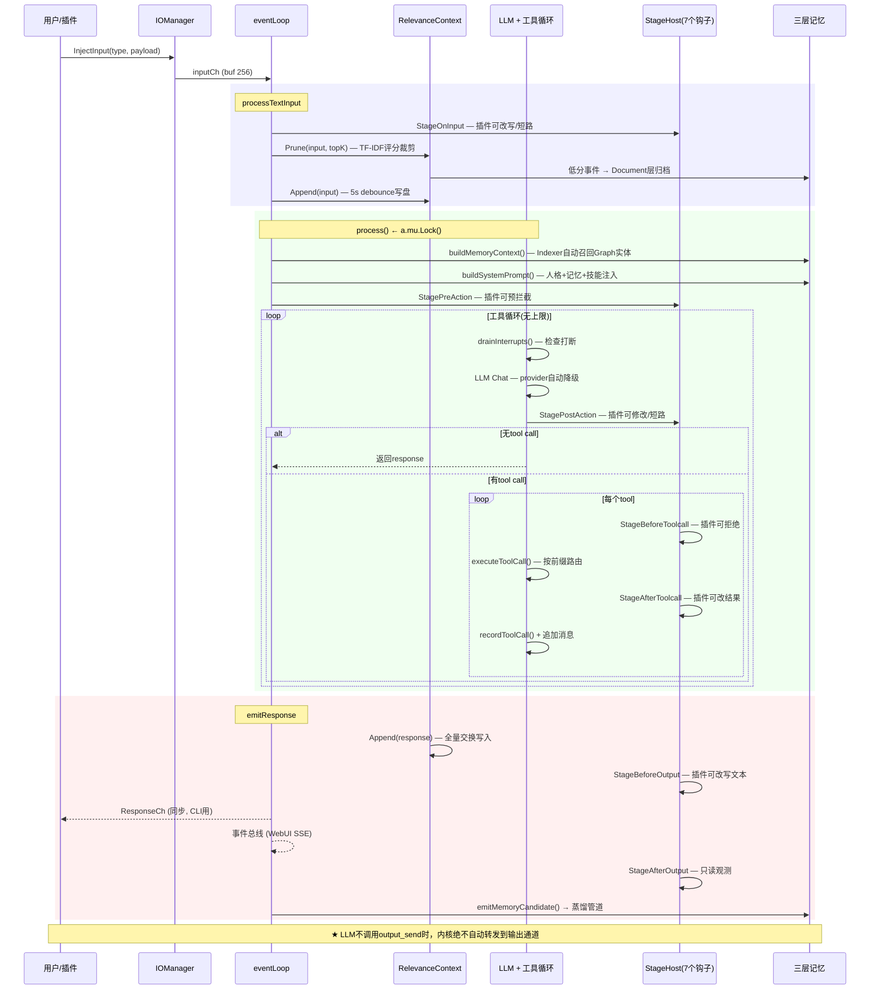
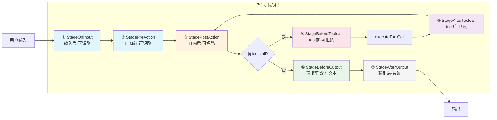
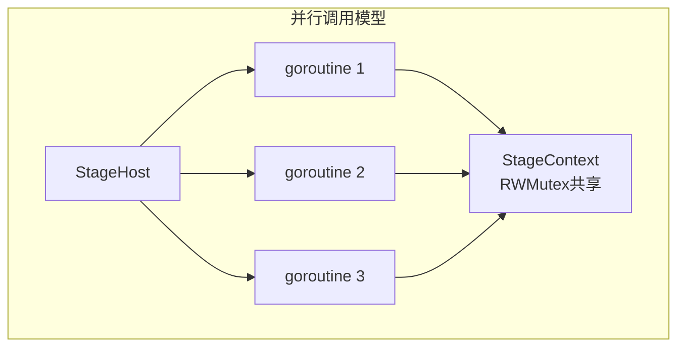

# HomeAgent

首个提出**核心域与应用域分离**的 Agent 框架。内核零 IO，一切外界交互由插件承载——WebUI、QQ、命令行、文件操作、网络搜索、备忘，全部是插件，内核不碰任何 IO。

配合**三层记忆架构**（Context → Document → Graph），单对话长期稳定运行，记忆不衰减。

```go
homed（内核零 IO） ← PluginSDK → 插件（所有 IO 能力）
```

## 核心创新

**核心域与应用域分离** — 内核只做 LLM 编排、记忆管理、知识检索；所有 IO 能力（收发消息、读写文件、网络请求、硬件交互）全由插件实现。插件可热加载、独立开发、独立发布。这不是 RPC 框架的微服务拆分，而是 Agent 框架层次的领域划分。

**三层记忆架构** — 解决 Agent 长期运行的记忆衰减问题：
- **Context 层**：TF-IDF 相关性评分的事件窗口，维护最近 topK 条上下文
- **Document 层**：临时记忆，冷数据自动下沉，也支持用户主动提交
- **Graph 层**：SQLite 图数据库，持久化实体关系和语义记忆，支持蒸馏管道从原始对话中提取三元组

## 架构图

### 一、消息处理时序



### 二、Stage 管道模型





| 阶段 | 位置 | 调用时机 | 可短路? | 可写字段 |
|------|------|----------|:-------:|----------|
| StageOnInput | ① | 构建stageCtx后 | ✅ | RawMessage / Response |
| StagePreAction | ② | 构建消息后,LLM前 | ✅ | ContextMsgs / Response |
| StagePostAction | ③ | LLM返回后,检查tool前 | ✅ | LLMText / ToolCalls / Response |
| StageBeforeToolcall | ④ | 每个tool执行前 | ✅(拒绝) | ToolCalls / Response |
| StageAfterToolcall | ⑤ | 每个tool执行后 | ❌ | ToolResults |
| StageBeforeOutput | ⑥ | 发送输出前 | ❌ | FinalText |
| StageAfterOutput | ⑦ | 发送输出后 | ❌ | (只读) |

### 三、三层记忆架构

#### TF-IDF 字符 n-gram 向量化（char 1-2 gram）

TF-IDF 是贯穿三层记忆的**核心算法**，在 4 个独立位置以不同方式使用：

| 位置 | 文件 | n-gram | 用途 | 算法 |
|------|------|:------:|------|------|
| Context Prune | `context.go:162` | 2 | 裁剪低相关性上下文事件 | CosineSimilarity(queryVec, evt.Vector) |
| DocStore Query | `document.go:205` | 2 | 从文档记忆召回相关内容 | InvertedIndex + CosineSimilarity |
| Indexer 实体搜索 | `indexer.go:149` | 2 | 从Graph图数据库召回相关实体 | InvertedIndex + CosineSimilarity |
| 实体相似度 | `agent.go:2297` | 2 | 检测Graph中相似实体 | Bigram Jaccard (>0.75→consolidation) |

#### 记忆流转图

```mermaid
flowchart TB
    subgraph "① Context 层 — 工作窗口"
        RC[RelevanceContext<br/>内存events[] + JSON文件]
        A[Append<br/>每次输入时调用] -->|Vectorize<br/>char 1-2gram TF-IDF| RC
        P[Prune<br/>TF-IDF CosineSimilarity<br/>保留 topK + 最近10条] -->|低分事件归档| CDoc
        P -->|保留| TL[timeline → system prompt<br/>按时间排序输出给LLM]
        S[save<br/>5s debounce写盘] --> RC
    end

    RC -->|读取全部事件| TL

    subgraph "② Document 层 — 文件记忆"
        D[DocStore<br/>JSON文件 + TF-IDF向量索引]
        CDoc[ContextToDoc<br/>Prune归档入口] -->|结构化摘要+标签+实体| D
        LLMDC[LLM工具<br/>doc_commit] -->|手动提交| D
        GSD[syncGraphToDocs<br/>每30min] -->|Graph快照| D
        Q[Query<br/>system prompt注入] -->|Vectorize输入<br/>InvertedIndex+Cosine<br/>召回top 3| D
        Q -->|格式: 【相关记忆文档】| SP
        AC[AccessCount++<br/>LastAccess更新] -->|每次Query命中| D
    end

    subgraph "③ Graph 层 — 图数据库"
        G[(SQLite)]
        G --> ENT[entities<br/>{Name,Type,Summary,Vector}]
        G --> REL[relations<br/>{PersonA,Relation,PersonB}]
        IDX[Indexer 自动召回<br/>每30min重建向量索引] -->|Vectorize实体名<br/>TF-IDF + BFS depth=2| G
        IDX -->|格式: 【记忆索引】| SP
        MEM[LLM工具<br/>memory_recall/commit/merge] --> G
        SOC[Social层<br/>person_query/set_trait/relate] --> G
    end

    subgraph "④ 蒸馏管道 — 每30min心跳"
        DC[distillContext<br/>窗口>2×max→强制Prune] -->|触发| P
        SYNC[syncGraphToDocs] -->|Graph→Document| GSD
        REORG[reorgGraph] -->|Step1| IDXSYNC[indexer.Sync<br/>重建实体向量索引]
        REORG -->|Step2| DREIDX[docStore.Reindex<br/>重建文档向量索引]
        REORG -->|Step3 冷文档→Graph| CD[FindColdDocs<br/>72h / ≤2次访问] -->|docToTriples| G
        REORG -->|Step4 实体相似度| BIGRAM[Bigram Jaccard<br/>>0.75] -->|consolidation| LLMCONS[LLM判断<br/>是否merge]
        REORG -->|Step5 图质量| QEVAL[evaluateGraphQuality<br/>低置信度关系] --> LLMCONS2[LLM判断<br/>保留/删除]
    end

    SP[System Prompt<br/>组装顺序] -->|base→人格→| GI[【记忆索引】<br/>Indexer召回实体]
    GI -->|清洗指令→| DM[【相关记忆文档】<br/>DocStore.Query top3]
    DM -->|技能注入→| TDS[工具定义] --> LLM

    subgraph "⑤ LLM 工具循环"
        LLM[LLM 推理] -->|memory_recall| MEM
        LLM -->|doc_query| Q2[doc_query 工具]
        Q2 -->|Consume<br/>读取并删除| D
        Q2 -->|③ 写入context<br/>原始时间戳+源cold_storage| RC
        Q2 -->|返回: 已加载N篇| LLM
        LLM -->|doc_commit| LLMDC
        LLM -->|output_send| OUT[输出通道]
    end

    subgraph "⑥ Pipeline 规则蒸馏器"
        PIPE[pipeline/distillOnce<br/>每心跳] -->|正则匹配| R1[我叫X→(用户,姓名,X)]
        PIPE -->|正则匹配| R2[我住在X→(用户,居住地,X)]
        PIPE -->|正则匹配| R3[我喜欢X→(用户,喜好,X)]
        PIPE -->|正则匹配| R4[我X岁→(用户,年龄,X)]
        PIPE -->|正则匹配| R5[我的工作是X→(用户,职业,X)]
        R1 & R2 & R3 & R4 & R5 -->|GraphDB.Commit| G
    end
```

| 层级 | 存储介质 | 索引 | 写入路径 | 读取路径 | 触发方式 |
|------|---------|------|----------|----------|---------|
| Context | 内存+JSON文件 | 无独立索引,TF-IDF向量缓存在event上 | Append(每次输入) | timeline格式化→system prompt | 自动 |
| Document | JSON文件 | TF-IDF InvertedIndex(char 1-2gram) | Prune归档 / doc_commit / Graph快照 | DocStore.Query→【相关记忆文档】→system prompt | 自动+LLM调用 |
| Graph | SQLite | 实体名TF-IDF向量索引(Indexer) + BFS遍历 | memory_commit / 冷文档蒸馏 / 规则蒸馏 | Indexer.BuildContext→【记忆索引】→system prompt | 自动+LLM调用 |

## 快速体验

```bash
make build build-cli
./build/homed -data /tmp/ha
```

```bash
# 交互模式
./build/waiter

# 或单条消息
echo "你好，记住我喜欢喝咖啡" | ./build/waiter
```

API 密钥通过 WebUI `http://localhost:8080` 设置页配置，持久化在 SQLite 中。

## 代码结构

```
cmd/homed/          守护进程入口，组装所有子系统
cmd/waiter/         CLI 客户端（Unix socket）
internal/
├── agent/core/     Agent 核心：事件循环、LLM 工具循环、7 阶段管道
├── agent/api/      LLM Provider + 8 个 Lua 适配器
├── memory/         三层记忆：Graph(SQLite) / Document(JSON+TF-IDF) / Text(JSONL)
├── knowledge/      知识库（文件系统 + TF-IDF）
├── plugin/         插件注册表 + .so 动态加载器
├── plugins/        内置 10 个插件（webui/cli/timer/cmd/mcp/openclaw/agentcli/healthcheck/pluginmgr/files）
├── internal/sdk/   PluginSDK（Tool/Stage/Event 三通道）
├── config/         SQLite 配置中心
├── events/         事件总线
└── lua/adapters/   8 个 LLM 协议适配器脚本
外部插件开发见 [homeagent-sdk](https://gitcode.com/JianFeeeee/homeagent-sdk) 仓库的 `example/` 目录
```

## 项目状态

核心可用，插件系统和 SDK 已就绪。内置 10 个插件，外部插件开发见 [homeagent-sdk](https://gitcode.com/JianFeeeee/homeagent-sdk) 仓库。

## 文档

- [项目概览](docs/OVERVIEW.md)
- [技术架构](docs/ARCHITECTURE.md)
- [插件开发指南](docs/PLUGIN_DEV.md)
- [Lua Adapter](docs/ADAPTER.md)
- [知识库演示](knowledge/homeagent_architecture/content.md)

## 构建

```bash
make build build-cli    # 编译守护进程 + CLI
make test               # go test ./...
make install            # 安装到系统
```

依赖：Go 1.19+, CGo (go-sqlite3), Linux。