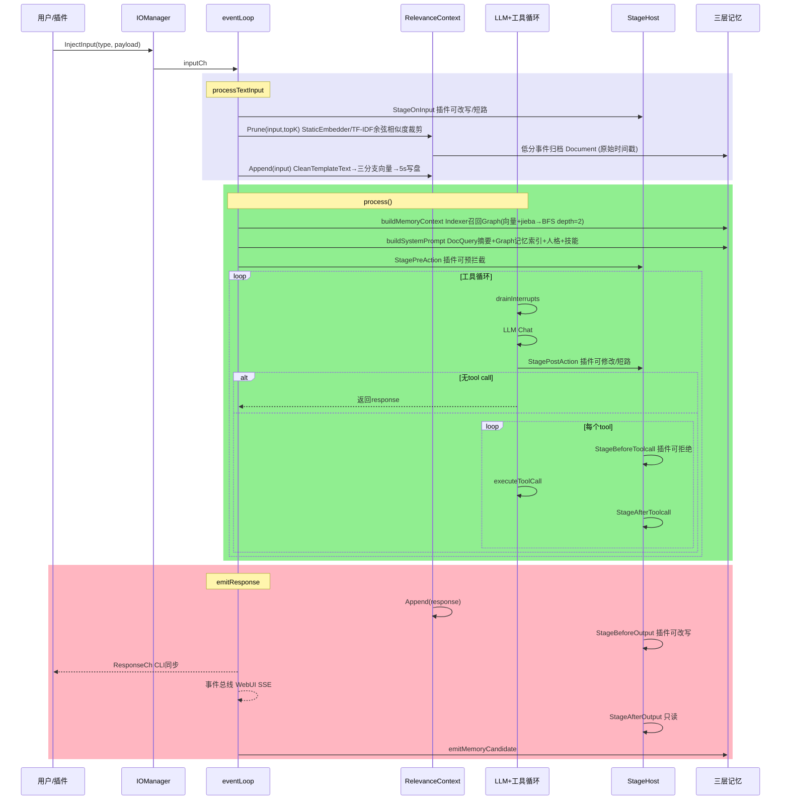
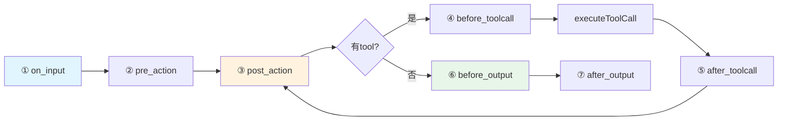
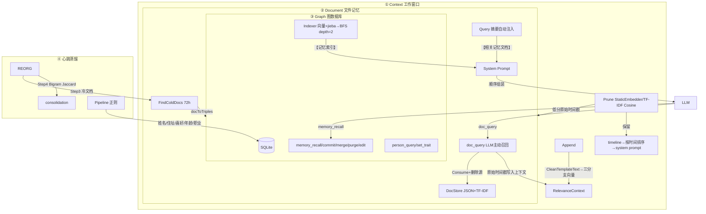

> ⚠️ **AI 辅助编程声明**：本项目代码、文档及提交历史中，部分内容由 AI 辅助生成或修改。人工已审阅关键改动，但使用时请自行评估与验证。

# HomeAgent

> **English**: [README_EN.md](./README_EN.md)

以**核心域与应用域分离**为设计原则的 Agent 框架。内核执行零 IO 策略——所有外部交互（WebUI、QQ、命令行、文件操作、网络搜索、备忘等）均由插件层承载，内核不直接处理任何 IO 操作。

配合**三层记忆架构**（Context → Document → Graph），通过分级存储与自动归档机制维持单会话长周期运行的上下文连贯性。

```go
homed（内核零 IO） ← PluginSDK → 插件（所有 IO 能力）
```

## 设计要点

**核心域与应用域分离** — 内核职责限定为 LLM 编排、记忆管理与知识检索；所有 IO 能力（消息收发、文件读写、网络请求、硬件交互等）由插件实现。这种划分在 Agent 框架层面进行领域边界界定，内核与插件各有其责任范围。

**三层记忆架构** — 通过分级存储策略管理 Agent 长期运行中的信息留存：

- **Context 层**：预训练词嵌入 / TF-IDF 回退的相关性评分事件窗口，保护最近 10 条，维护 topK 条上下文
- **Document 层**：临时记忆，冷数据自动下沉，也支持用户主动提交
- **Graph 层**：SQLite 图数据库，持久化实体关系和语义记忆，支持蒸馏管道从原始对话中提取三元组

## 架构图

### 一、消息处理时序



### 二、Stage 管道



### 三、三层记忆



详细说明见 [`assets/docs/zh/ARCHITECTURE.md`](assets/docs/zh/ARCHITECTURE.md)。

## 看板娘

<div align="center">
  
  <p><strong>小宅</strong> — HomeAgent 看板娘</p>
</div>

## 快速体验

```bash
make build build-cli
./build/homed -data /tmp/ha
```

```bash
# 交互模式
./build/waiter

# 或单条消息
echo "你好，记住我喜欢喝咖啡" | ./build/waiter
```

API 密钥通过 WebUI `http://localhost:8080` 设置页配置，持久化在 SQLite 中。

## 代码结构

```
cmd/homed/          守护进程入口，组装所有子系统
cmd/waiter/         CLI 客户端（Unix socket）
internal/
├── agent/core/     Agent 核心：事件循环、LLM 工具循环、7 阶段管道
├── agent/api/      LLM Provider + 8 个 Lua 适配器
├── memory/         三层记忆：Graph(SQLite) / Document(JSON+TF-IDF) / Text(JSONL) + StaticEmbedder(预训练词嵌入/TF-IDF回退) + CleanTemplateText(去模版)
├── knowledge/      知识库（文件系统 + TF-IDF）
├── plugin/         插件注册表 + .so 动态加载器
├── plugins/        内置 11 个插件（webui/cli/timer/cmd/mcp/clawhubadapter/agentcli/healthcheck/pluginmgr/files/cfgmgr）
├── sdk/            PluginSDK（Tool/Stage/Event 三通道）
├── config/         SQLite 配置中心
├── events/         事件总线
└── internal/lua/adapters/   8 个 LLM 协议适配器脚本
外部插件开发见 [homeagent-sdk](https://gitcode.com/JianFeeeee/homeagent-sdk) 仓库，使用 `plugindev` 工具链开发，参考 `example/` 目录下的 Go 和 Lua 示例
```

## 项目状态

**v0.9.0** — C ABI v2：外部插件 Stage 回调支持写回（`invoke_stage` 增加 result 输出，插件可在 OnInput/AfterToolcall/PostAction 修改 RawMessage/LLMText/ToolResults 等并同步回内核），ABI 版本随内核 minor 对齐（v0.9.x → ABIVersion=2，`version_min=1` 向后兼容旧插件）。同步修复工具循环 zen 兼容补位误伤首轮 system 上下文的问题。配套 SDK 提供增强版 sanitizer 示例（坏 UTF-8/U+FFFD/ANSI 转义全链路清洗）。

**v0.8.0** — 核心可用，插件系统增强。内置 20+ 插件，外部插件开发见 [homeagent-sdk](https://gitcode.com/JianFeeeee/homeagent-sdk) 仓库。新增输入通道 `NoMemory`/`Cleaner`、`ChannelDef`、插件禁用/启用系统（CLI + WebUI），`plugindev` 工具链完成 C ABI `ChannelDef` 传递。

## 文档

- [项目概览](assets/docs/zh/OVERVIEW.md) | [English](assets/docs/en/OVERVIEW.md)
- [技术架构](assets/docs/zh/ARCHITECTURE.md) | [English](assets/docs/en/ARCHITECTURE.md)
- [插件开发指南](assets/docs/zh/PLUGIN_DEV.md) | [English](assets/docs/en/PLUGIN_DEV.md)
- [Lua Adapter](assets/docs/zh/ADAPTER.md) | [English](assets/docs/en/ADAPTER.md)
- [知识库演示](assets/knowledge/homeagent_architecture/content.md)

## 构建

```bash
make build build-cli    # 编译守护进程 + CLI
make test               # go test ./...
make install            # 安装到系统
```

依赖：Go 1.25+, CGo (go-sqlite3), Linux/Windows。
