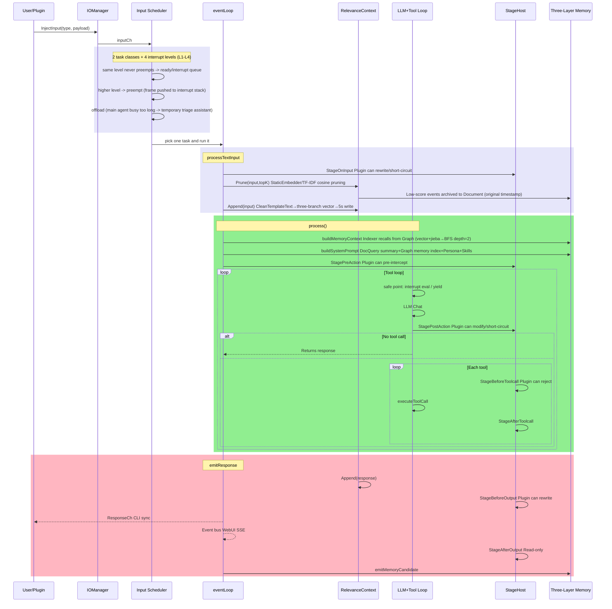
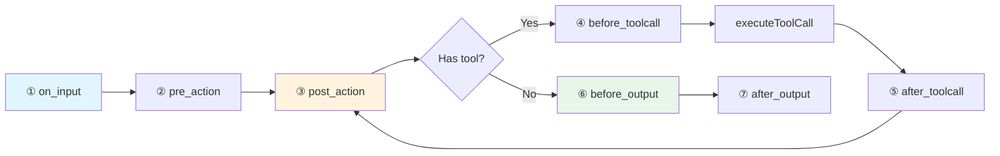

> ⚠️ **AI-Assisted Programming Notice**: Parts of this project's code, documentation, and commit history were generated or modified with AI assistance. Key changes have been human-reviewed, but please evaluate and verify before use.

# HomeAgent

> **中文**: [README.md](./README.md)

An Agent framework designed around **separation of core domain and application domain**. The kernel enforces a zero-IO policy — all external interaction (WebUI, QQ, CLI, file operations, web search, memos, etc.) is handled by the plugin layer; the kernel performs no direct IO operations.

Combined with a **three-layer memory architecture** (Context → Document → Graph), it maintains contextual coherence across long-running single-conversation sessions through tiered storage and automated archival.

```go
homed (kernel, zero IO) ← PluginSDK → plugins (all IO capabilities)
```

**Since v1.1.1 media reaches the plugin boundary**: plugins and the model can both read and
write images/audio in memory (`InsertWithMedia`, `InjectInputMedia`). Media lives in plain-text
memory as a `[<mime> <short digest>] <description>` marker — the description is the searchable
semantic memory, the digest is the key back to the bytes.

**Since v1.0.0 external plugins are independent subprocesses**, communicating with the kernel over
stdio JSON-RPC (control plane) + a shared memory segment (data plane) + an event ring (notification
plane). A plugin crash cannot take down the kernel and it restarts automatically; swapping
`plugin.bin` gives true hot-reload.

## Design Principles

**Separation of Core Domain and Application Domain** — The kernel's responsibilities are limited to LLM orchestration, memory management, and knowledge retrieval; all IO capabilities (message send/receive, file read/write, network requests, hardware interaction, etc.) are implemented by plugins. This separation defines domain boundaries at the Agent framework level, with distinct responsibility scopes for the kernel and plugins.

**Three-Layer Memory Architecture** — Manages information retention in long-running agents through a tiered storage strategy:

- **Context Layer**: Pretrained word embedding / TF-IDF fallback relevance-scored event window, protects last 10 entries, maintains topK context entries
- **Document Layer**: Temporary memory with automatic cold data sinking, also supports user-initiated submissions
- **Graph Layer**: SQLite graph database, persists entity relationships and semantic memory, supports distillation pipelines to extract triples from conversations

**Input Scheduling: 2 classes + 4 interrupt levels** — Input does not go straight to the LLM;
it first enters the scheduler. Two classes (queued = pending work, interrupt = ranked L1–L4 by
"how urgent") with preemption and frame saving (interrupt stack); same level never preempts
same level. L4 belongs only to the kernel and kernel-level plugins (e.g. the WebUI stop button).
See "Input Scheduler & Interrupt Mechanism" in [`assets/docs/en/ARCHITECTURE.md`](assets/docs/en/ARCHITECTURE.md).

**Resident sub-agents** — The kernel can station lightweight-kernel child agents (their own
scheduler and temp graph memory, sharing the channel registry) to run long or backlogged work
in parallel. When the main agent stays busy, the kernel hands queued input to a temporary
**triage assistant**: simple items are handled directly, items needing the main agent get an
immediate "busy, please wait" — users no longer wait in silence.
See [`docs/zh/resident-subagent-design.md`](docs/zh/resident-subagent-design.md).

## Architecture Diagrams

### 1. Message Processing Sequence



### 2. Stage Pipeline



### 3. Three-Layer Memory

```mermaid
flowchart TB
    subgraph C[① Context Working Window]
        RC[RelevanceContext]
        A[Append] -->|CleanTemplateText→three-branch vector| RC
        P[Prune StaticEmbedder/TF-IDF Cosine] -->|Low score original timestamp| D
        P -->|Keep| TL[timeline→chronological→system prompt]
    end
    subgraph D[② Document File Memory]
        DS[DocStore JSON+TF-IDF]
        Q1[Query summary auto-inject] -->|[Related Memory Docs]| SP
        Q2[doc_query LLM active recall] -->|Consume+delete source| DS
        Q2 -->|Original timestamp write to context| RC
        CD[FindColdDocs 72h] -->|docToTriples| G
    end
    subgraph G[③ Graph Database]
        DB[(SQLite)]
        IDX[Indexer vector+jieba→BFS depth=2] -->|[Memory Index]| SP
        MEM[memory_recall/commit/merge/purge/edit]
        SOC[person_query/set_trait]
    end
    subgraph H[④ Heartbeat Distillation]
        REORG -->|Step3 Cold docs| CD
        REORG -->|Step4 Bigram Jaccard| CONS[consolidation]
        PIPE[Pipeline regex] -->|Name/Address/Likes/Age/Job| DB
    end
    SP[System Prompt] -->|Sequential assembly| LLM
    LLM[LLM] -->|doc_query| Q2
    LLM -->|memory_recall| MEM
```

See [`assets/docs/en/ARCHITECTURE.md`](assets/docs/en/ARCHITECTURE.md) for details.

## Web Mascot

<div align="center">
  
  <p><strong>Xiaozhai</strong> — HomeAgent Web Mascot</p>
</div>

## Quick Start

```bash
make build build-cli
./build/homed -data /tmp/ha
```

```bash
# Interactive mode
./build/waiter

# Or single message
echo "Hello, remember that I like coffee" | ./build/waiter
```

API keys are configured via WebUI `http://localhost:8080` settings page, persisted in SQLite.

## Code Structure

```
cmd/homed/          Daemon entry, assembles all subsystems
cmd/waiter/         CLI client (Unix socket)
internal/
├── agent/core/     Agent core: input scheduler (2 classes + 4 levels), event loop, LLM tool loop, 7-stage pipeline, residents
├── agent/api/      LLM Provider (Lua adapter layer: provider.go drives the vm)
├── memory/         Three-layer memory: Graph(SQLite) / Document(JSON+TF-IDF) / Text(JSONL) + StaticEmbedder(pretrained word embedding/TF-IDF fallback) + CleanTemplateText(de-template)
├── knowledge/      Knowledge base (filesystem + TF-IDF)
├── plugin/         Plugin registry + subprocess loader (stdio RPC + shared memory segment + event ring)
├── plugins/        18 built-in plugins (webui/cli/timer/cmd/mcp/files/cfgmgr/agentcli/healthcheck/pluginmgr/clawhubadapter/multimodal/remotedevice/ai_image/localuse/skillmgr/data, ...)
├── sdk/            PluginSDK (Tool/Stage/Event three channels)
├── config/         SQLite config center
├── events/         Event bus
└── internal/lua/adapters/   10 LLM protocol adapter scripts
External plugin development: see [homeagent-sdk](https://gitcode.com/JianFeeeee/homeagent-sdk) repo, use `hmapdev` toolchain, refer to Go and Lua examples in `example/`
```

## Project Status

**v1.3.x line** (v1.3.1–v1.3.12, latest released) — **resident sub-agents** + **input scheduler rework**.

- **Resident sub-agents**: the kernel can station lightweight-kernel child agents (their own
  scheduler, their own temp graph memory, sharing the channel registry). The parent dispatches
  and collects work via `resident_agents` (list/create/send/inspect/compress/reclaim/destroy).
  An inputch can be assigned to a child, so input is routed to it **before entering the kernel**.
- **Output channels addressable to a specific agent**: the `AllowedOutputs` grant set
  (consistent across all three filter points) lets parent/child deliver to each other;
  device capabilities became output channels too (one `device/<id>` per device).
- **Input scheduler**: two task classes (queued/interrupt) + four interrupt levels (L1–L4)
  + preempt/suspend/resume/interrupt-stack; same level never preempts same level, with a
  starvation guard and preemption cooldown. L4 belongs only to the kernel and kernel-level
  plugins (e.g. the WebUI stop button).
- **Lightweight kernel profile**: a child's memory surface narrows to "conventional context
  + graph memory" (narrow interface; the main graph opens as a query_only handle, writes go
  to its own temp instance).
- **Backlog timely feedback** (later in the line): when the main agent is busy for a long time,
  the kernel hands queued input to a temporary **triage assistant** — simple items are handled
  directly, items needing the main agent get an immediate "busy, please wait", so users no
  longer wait 10+ minutes in silence.
- Fixed a batch of real defects: inbound inputch (`child/<id>`) registration leak on resident
  destruction, a child's round count always showing 0 (`info()` never filled it), an empty
  child-side childIO (output channels not inherited), device heartbeat pong missing Flush
  (dropping every 60s), and Lua plugin bridge alignment with SDK 1.3.0.

**v1.2.0** — unified multimodal vector space, media promoted to first-class graph memory, and the whole data plane moved into shared memory.

- **Model-neutral unified embedding space**: the kernel no longer adapts to any specific model.
  It exposes only a public provider SPI (`pkg/embedding`: `Modality` / `Input{Data,MIME}` /
  `Info{Dimension,Fingerprint,Modalities}` + a name registry), with implementations under
  `providers/*`. Default: **Chinese-CLIP ViT-B/16** — text and image land in the **same space**
  (512-dim, fingerprint `cd2a495cf990`, Apache-2.0; measured ~1.59GB peak on load, settling to ~0.89GB steady-state);
  `qwen3vl` is kept (2048-dim, ~9.4GB) for machines with headroom or future video. Text search
  still falls back to the existing word-vector / TF-IDF path — a CLIP dual tower's pure-text
  semantics are **weaker than an MLLM-style embedder**, a cost documented rather than hidden.
- **Media are first-class nodes and edges in the graph DB**: the "index images via generated
  text descriptions" stopgap, `media_refs` and media reference counting are **removed**.
  Memory blocks follow a single-layer invariant — Context → Document → Graph is a **migration**,
  not a copy, and not kept alive by references.
- **The entire data plane goes through shared memory** (tool-call frames, Cleaners, input/output
  lanes, media blocks, document and knowledge bodies); RPC carries only offset descriptors.
  **RPC protocol is now 2**: the fd3 layout changed and there is **no rolling upgrade** —
  kernel and all plugins must be rebuilt and installed together.
- Injections can declare `InjectOptions{NoMemory, ContextPolicy}` (**defaults: still recorded,
  not pruned**); pruning must be requested explicitly and goes through the plugin's registered
  `Cleaner`. SDK 1.2.0 is **purely additive** over 1.1.0.
- **Release packages enable the ONNX space by default** and bundle the model (754MB) plus
  ONNX Runtime (24MB) in the server/full packages; `homed` drops native Windows support in
  favour of WSL2; the jieba dictionary is embedded in the binary.
- Fixed three **silent install-chain failures**: `initconfig` was a no-op (`CGO_ENABLED=0` stub)
  that printed credentials without writing any, fresh installs were misdetected as "already
  configured" so default seeding was skipped entirely (0 plugins installed), and the deb
  `postinst` looked for the unit in the wrong path so `enable` never ran.
- Licensed **AGPL-3.0-only** from this version on (network clause included; statically linked
  plugins must match — see License).

> The historical entries below are kept verbatim to show the evolution; two mechanisms in them
> were **removed in v1.2.0**: text-description-based media indexing, and reference-counted media GC.
>
> **One licensing statement has also changed** (2026-09-24): "statically linked plugins must match"
> in the v1.2.0 entry below **no longer holds**. The SDK is now released under **MIT** (a permissive
> license that does not inherit the kernel's AGPL), so external plugins are **not** derivative works
> of this project: authors choose their own license (closed-source, commercial or private included)
> and are not bound by §13. The original text is kept to show the position at the time.
>
> **Two performance claims also need correcting** (measured 2026-09-20):
> "crash-to-recovery under 1s" does not hold — restarts are **linearly backed off**, i.e.
> 1s / 2s / 3s (`procRestartBackoff=1s × nth crash`). Even the *first* restart waits 1s.
> And the **4th** crash within a 5-minute window stops automatic restarts pending human
> intervention (`procMaxRestarts=3`, tested as `n > 3`).
> The backoff was already 1s when this claim was written (v1.0.0), so it never held.
> "RPC round-trip p50 24.1µs" is the right order of magnitude but does not match current
> measurements: `BenchmarkToolInvoke` on this machine gives inline/small **30.4µs**,
> frame/small 51.5µs, inline/large 767µs, frame/large 398µs.
> The original text is left unedited rather than rewritten, so the history isn't falsified.

**v1.1.1** — Multimodal reaches the **plugin boundary**. v1.1.0 gave the memory system binary
multimedia nodes, but that path was open only to the kernel itself; this release opens it to
plugins and the model. The public SDK gains media fields and three media injection methods
(paired with [SDK v1.1.0](https://gitcode.com/JianFeeeee/homeagent-sdk/releases/tag/v1.1.0),
shared by the whole 1.1.x line), and the kernel implements the four matching RPCs. The bridge
layer had been **silently dropping fields**: `Confidence`/types/`SentenceText` handed in by a
plugin were discarded, `Doc` kept only three fields, and `Remove` never released references
(media stayed "referenced" forever, so GC could never reclaim it). `processTextInput` and
`processMediaInput` were unified into a single `processInput`, which finally gives the media
path the dedup, `no_memory`, channel `Cleaner`, interrupt semantics and correct `EventRawInput`
it had always lacked. Three real defects fixed: **user-sent images never appeared in the WebUI
chat log** (the media path published a map while the subscriber asserted a string),
**`memory_commit`'s `sentence_text` had never been exposed to the model** (though it is the
mandatory link in the media binding chain), and **two data races in `PluginSDK`** (11 reported
by `-race`; in production this showed up as sporadic nil-dereference crashes during plugin reload).

**v1.1.0** — Memory system supports **binary multimedia nodes**. Content-addressed media store
(CAS + SQLite metadata + on-disk blobs, `Get` always re-verifies the digest) wired through L0
(context events) / L2 (documents) / L3 (graph sentences), with reference-counted GC (referenced
items are never deleted). The description text produced by the vision model is the durable
semantic memory; the blob is only a cache that capacity GC may evict.

**v1.0.0** — External plugins moved from C ABI shared libraries to **subprocess + shared memory**. The first release that no longer loads `.so`/`.dll`, and it is incompatible with 0.9.x (existing plugins must be rebuilt into `plugin.bin` with the new toolchain — called `plugindev` back then, **now `hmapdev`** — though **business code needs zero changes**). Eliminates 6 classes of defects that had caused production incidents: hot-reload silently failing (`DF_1_NODELETE` making `dlclose` a no-op), no crash isolation (a plugin panic took down homed), stage lost updates (35.8~36.8% loss under the copy model), uncancellable cgo timeouts (linear OS-thread leaks), `output_send` reporting false success (the model was told "sent" while the message never went out), and Windows capability degradation (only 3 stage fields visible, no write-back). Three communication planes: stdio JSON-RPC (control) + shared memory segment (data) + event ring (notification); the privilege gradient is now enforced by three explicit gates. RPC round-trip p50 24.1µs; crash-to-recovery under 1s.

**v0.9.0** — C ABI v2: external plugin Stage callbacks can now write back (`invoke_stage` gained a result out-param; plugins may mutate RawMessage/LLMText/ToolResults etc. in OnInput/AfterToolcall/PostAction and have them synced to the core). ABI version now tracks core minor releases (v0.9.x → ABIVersion=2, `version_min=1` keeps old plugins loadable). Also fixes the tool-loop zen-compat placeholder that wrongly fired on first-turn system context tail. The SDK ships an enhanced sanitizer example (bad-UTF-8 / U+FFFD / ANSI-escape scrub across the whole pipeline). **This ABI retired with v1.0.0.**

**v0.8.0** — Core is functional, plugin system enhanced. 20+ built-in plugins. External plugin development via [homeagent-sdk](https://gitcode.com/JianFeeeee/homeagent-sdk) repo. Added input channel `NoMemory`/`Cleaner`, `ChannelDef`, plugin disable/enable system (CLI + WebUI), `plugindev` toolchain C ABI `ChannelDef` support.

## Documentation

- [Project Overview](assets/docs/en/OVERVIEW.md) | [中文](assets/docs/zh/OVERVIEW.md)
- [Technical Architecture](assets/docs/en/ARCHITECTURE.md) | [中文](assets/docs/zh/ARCHITECTURE.md)
- [Plugin Development Guide](assets/docs/en/PLUGIN_DEV.md) | [中文](assets/docs/zh/PLUGIN_DEV.md)
- [Lua Adapter](assets/docs/en/ADAPTER.md) | [中文](assets/docs/zh/ADAPTER.md)
- [Knowledge Base Demo](assets/knowledge/homeagent_architecture/content.md)

## Downloads

[Releases](https://gitcode.com/JianFeeeee/HomeAgent/releases) ship three variants:

| Variant | Contents | For |
|---|---|---|
| **full** | homed + waiter + desktop GUI + systemd unit | Single-machine, everything |
| **server** | homed + waiter + systemd unit | Servers (no desktop environment) |
| **client** | waiter + desktop GUI | Connecting to a remote HomeAgent |

- Linux: `.deb` (amd64/arm64), `.rpm` (x86_64), `.tar.gz`
- Windows: `HomeAgent_v1.2.0_{Full,Server,Client}_win64.exe` (NSIS installer, includes the AGPL license page). Since v1.2.0 `homed` no longer supports native Windows (it relies on fd inheritance and in-segment offset dereferencing), so the installer bootstraps **WSL2** and installs the Linux packages inside the distribution the same way a Linux host would.
- Portable: `homeagent-bin-<os>_<arch>.tar.gz` (homed/waiter/initconfig)
- Verification: `SHA256SUMS`

The macOS `homed` requires a native macOS build (CGO + sqlite3), so release packages ship only `waiter`/`initconfig`.

## Build

```bash
make build build-cli    # Build daemon + CLI
make test               # go test ./...
make install            # Install to system
```

Dependencies: Go 1.25+, CGo (go-sqlite3), Linux.

> `homed` requires Linux (it relies on fd inheritance and intra-segment offset
dereferencing of the shared memory region; see `cmd/homed/platform_windows.go`).
On Windows only `waiter.exe` is built and `homed` runs under WSL2 (see Downloads).
macOS can build `waiter`/`initconfig`; `homed` must be built on native macOS.

## License

This project is released under the **GNU Affero General Public License, version 3
(AGPL-3.0-only)** — see [LICENSE](LICENSE).

This is the strongest copyleft in the GPL family: besides shipping the complete corresponding
source when you distribute the software, **you must also offer the source to users who interact
with it over a network** (§13, Remote Network Interaction). Anyone running a modified HomeAgent
as a network service therefore has to make the modified source available to that service's users.

Plugins are **statically linked** against this project through the public
[homeagent-sdk](https://gitcode.com/JianFeeeee/homeagent-sdk) (the SDK source ends up inside the
plugin binary), but that repository is released under **MIT** — a permissive license, so code
received under it does **not** inherit this project's AGPL. External plugins are therefore **not
derivative works of this project**: authors pick their own license (closed-source, commercial or
private included), with no same-license obligation and no §13 network clause. The safety and
vitality of the third-party plugin ecosystem rest on this.

The boundary is clean: **AGPL covers the kernel and the bundled plugins** (`homed`, `internal/`,
the 18 built-in plugins under `internal/plugins/`); **MIT covers the public SDK** (`sdk/`, whose
`go.mod` has zero external dependencies and imports only the Go standard library — it never
references any kernel code). Process isolation is beside the point here — what decides the
license is the linked SDK code itself, and that code is MIT.

### Third-party components shipped with the packages

| Component | License | Location |
|---|---|---|
| Chinese-CLIP ViT-B/16 (ONNX artifacts) | Apache-2.0 | `/usr/lib/homeagent/models/chinese-clip-vit-b16-onnx/` |
| ONNX Runtime (`libonnxruntime.so`) | MIT | `/usr/lib/homeagent/onnxruntime/` |
| jieba dictionary (embedded in the binary) | MIT | `internal/memory/jiebadict/` |
| Go dependencies (go-sqlite3, gojieba, bubbletea, …) | MIT / BSD-3 / Apache-2.0 | permissive, AGPL-3.0-compatible |

These components keep their own licenses and are not relicensed by this project. Full texts are
shipped in `/usr/share/doc/homeagent/licenses/`, and the package metadata declares this package
as `AGPL-3.0-only`.
