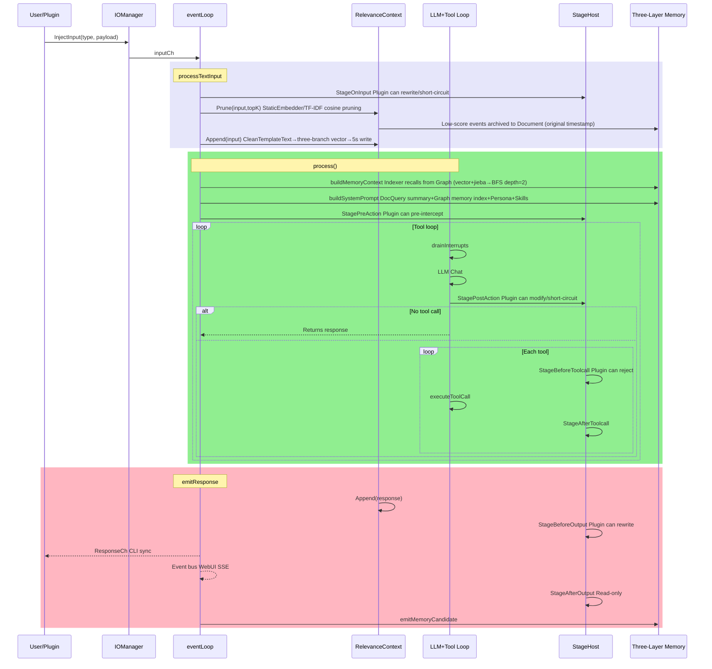
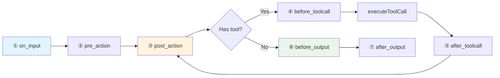

> ⚠️ **AI-Assisted Programming Notice**: Parts of this project's code, documentation, and commit history were generated or modified with AI assistance. Key changes have been human-reviewed, but please evaluate and verify before use.

# HomeAgent

> **中文**: [README.md](./README.md)

An Agent framework designed around **separation of core domain and application domain**. The kernel enforces a zero-IO policy — all external interaction (WebUI, QQ, CLI, file operations, web search, memos, etc.) is handled by the plugin layer; the kernel performs no direct IO operations.

Combined with a **three-layer memory architecture** (Context → Document → Graph), it maintains contextual coherence across long-running single-conversation sessions through tiered storage and automated archival.

```go
homed (kernel, zero IO) ← PluginSDK → plugins (all IO capabilities)
```

**Since v1.0.0 external plugins are independent subprocesses**, communicating with the kernel over
stdio JSON-RPC (control plane) + a shared memory segment (data plane) + an event ring (notification
plane). A plugin crash cannot take down the kernel and it restarts automatically; swapping
`plugin.bin` gives true hot-reload.

## Design Principles

**Separation of Core Domain and Application Domain** — The kernel's responsibilities are limited to LLM orchestration, memory management, and knowledge retrieval; all IO capabilities (message send/receive, file read/write, network requests, hardware interaction, etc.) are implemented by plugins. This separation defines domain boundaries at the Agent framework level, with distinct responsibility scopes for the kernel and plugins.

**Three-Layer Memory Architecture** — Manages information retention in long-running agents through a tiered storage strategy:

- **Context Layer**: Pretrained word embedding / TF-IDF fallback relevance-scored event window, protects last 10 entries, maintains topK context entries
- **Document Layer**: Temporary memory with automatic cold data sinking, also supports user-initiated submissions
- **Graph Layer**: SQLite graph database, persists entity relationships and semantic memory, supports distillation pipelines to extract triples from conversations

## Architecture Diagrams

### 1. Message Processing Sequence



### 2. Stage Pipeline



### 3. Three-Layer Memory

```mermaid
flowchart TB
    subgraph C[① Context Working Window]
        RC[RelevanceContext]
        A[Append] -->|CleanTemplateText→three-branch vector| RC
        P[Prune StaticEmbedder/TF-IDF Cosine] -->|Low score original timestamp| D
        P -->|Keep| TL[timeline→chronological→system prompt]
    end
    subgraph D[② Document File Memory]
        DS[DocStore JSON+TF-IDF]
        Q1[Query summary auto-inject] -->|[Related Memory Docs]| SP
        Q2[doc_query LLM active recall] -->|Consume+delete source| DS
        Q2 -->|Original timestamp write to context| RC
        CD[FindColdDocs 72h] -->|docToTriples| G
    end
    subgraph G[③ Graph Database]
        DB[(SQLite)]
        IDX[Indexer vector+jieba→BFS depth=2] -->|[Memory Index]| SP
        MEM[memory_recall/commit/merge/purge/edit]
        SOC[person_query/set_trait]
    end
    subgraph H[④ Heartbeat Distillation]
        REORG -->|Step3 Cold docs| CD
        REORG -->|Step4 Bigram Jaccard| CONS[consolidation]
        PIPE[Pipeline regex] -->|Name/Address/Likes/Age/Job| DB
    end
    SP[System Prompt] -->|Sequential assembly| LLM
    LLM[LLM] -->|doc_query| Q2
    LLM -->|memory_recall| MEM
```

See [`assets/docs/en/ARCHITECTURE.md`](assets/docs/en/ARCHITECTURE.md) for details.

## Web Mascot

<div align="center">
  
  <p><strong>Xiaozhai</strong> — HomeAgent Web Mascot</p>
</div>

## Quick Start

```bash
make build build-cli
./build/homed -data /tmp/ha
```

```bash
# Interactive mode
./build/waiter

# Or single message
echo "Hello, remember that I like coffee" | ./build/waiter
```

API keys are configured via WebUI `http://localhost:8080` settings page, persisted in SQLite.

## Code Structure

```
cmd/homed/          Daemon entry, assembles all subsystems
cmd/waiter/         CLI client (Unix socket)
internal/
├── agent/core/     Agent core: event loop, LLM tool loop, 7-stage pipeline
├── agent/api/      LLM Provider + 8 Lua adapters
├── memory/         Three-layer memory: Graph(SQLite) / Document(JSON+TF-IDF) / Text(JSONL) + StaticEmbedder(pretrained word embedding/TF-IDF fallback) + CleanTemplateText(de-template)
├── knowledge/      Knowledge base (filesystem + TF-IDF)
├── plugin/         Plugin registry + subprocess loader (stdio RPC + shared memory segment + event ring)
├── plugins/        11 built-in plugins (webui/cli/timer/cmd/mcp/clawhubadapter/agentcli/healthcheck/pluginmgr/files/cfgmgr)
├── sdk/            PluginSDK (Tool/Stage/Event three channels)
├── config/         SQLite config center
├── events/         Event bus
└── internal/lua/adapters/   8 LLM protocol adapter scripts
External plugin development: see [homeagent-sdk](https://gitcode.com/JianFeeeee/homeagent-sdk) repo, use `plugindev` toolchain, refer to Go and Lua examples in `example/`
```

## Project Status

**v1.0.4** — Two data-race fixes (the live `/api/v1/device/ws` gateway and terminal streaming). A full `-race` pass exposed both: `remotedevice` wrote one connection's `bufio.Writer` from two concurrent paths (`handleWS` loop replies hello_ack/bind_ack/pong, plus `PushJSON`/`PushData` agent→device pushes) — `bufio.Writer` is not thread-safe, and `TestWSPushDataAudio` async push hit it reliably; `agentcli` handed the shared read buffer to the reader goroutine (which the OS keeps overwriting) while `readLoop` did `copy(data, buf[:r.n])` — concurrent read/write of the same buffer. Fix: connection-level write lock (`wconn.wmu`, shared by Push* and handleWS; `PushData` holds it across the whole start/chunks/end sequence to preserve protocol order) plus carrying read results in per-result slices instead of a shared buffer. Repo-wide `go test ./... -race` went from 7 races / 5 failing tests to all-clean.

**v1.0.3** — Kernel stage-coordinator double-unlock fix. The production `homed` main process once died outright with `fatal error: sync: unlock of unlocked mutex`, taking all 27 subprocess plugins with it: `Host.endStage` performed "decrement inflight, decide whether I'm the last leaver" *outside* the `coordMu` critical section while detaching the coordinator *inside* it, so a late-arriving plugin could attach to a coordinator that was already finishing, be misjudged as the last leaver, and unlock the same `stageMu` twice. **A `sync.Mutex` double unlock is a runtime fatal, not a panic, so the two layers of `recover` structurally cannot catch it**—which is exactly why the "a crashing plugin must not take down the kernel" isolation design failed wholesale here. The fix folds counting, decision, and detach into one critical section, and also moves the first arriver's `enter()` (which writes the shared segment) inside the lock—previously a late arriver could read a half-written segment. Ships with 5 regression cases, including a reverse check that stashes the old implementation back to confirm the tests really do reproduce the fatal.

**v1.0.1** — Multimodal bugfix. The plugin ABI/protocol is unchanged, so `plugin.bin` artifacts built for 1.0.0 need no rebuild. Three defects fixed: (1) **vision silently failing**—media blocks attached to a tool message are not treated as viewable content by the model (measured on one image: 0/3 read from a tool message, 3/3 from a standalone user message); media now rides its own user message placed immediately after, which is what the plugin's own wording ("injected into the following conversation") always claimed; (2) **new multimodal capability declaration + fallback chain**—`core.llm.sources.<name>.vision/.audio` declares whether a source can genuinely process media (a gateway may strip `image_url` and still return 200, with identical prompt_tokens with and without the image); when it cannot, media is transcribed to text via a vision-capable source, finally wiring up the long-registered but never-read `core.input_processing.image.fallback_provider` settings; (3) **`see_video` frame-count semantics were inverted**—`fps=1/N` is a *rate*, not a count, so a 20s video yielded 2 frames when 10 were requested and 20 frames when 1 was requested; now `ffprobe` measures duration and the filter becomes `fps=N/duration` with `-frames:v` as a hard cap.

**v1.0.0** — External plugins moved from C ABI shared libraries to **subprocess + shared memory**. The first release that no longer loads `.so`/`.dll`, and it is incompatible with 0.9.x (existing plugins must be rebuilt into `plugin.bin` with the new `plugindev`, though **business code needs zero changes**). Eliminates 6 classes of defects that had caused production incidents: hot-reload silently failing (`DF_1_NODELETE` making `dlclose` a no-op), no crash isolation (a plugin panic took down homed), stage lost updates (35.8~36.8% loss under the copy model), uncancellable cgo timeouts (linear OS-thread leaks), `output_send` reporting false success (the model was told "sent" while the message never went out), and Windows capability degradation (only 3 stage fields visible, no write-back). Three communication planes: stdio JSON-RPC (control) + shared memory segment (data) + event ring (notification); the privilege gradient is now enforced by three explicit gates. RPC round-trip p50 24.1µs; crash-to-recovery under 1s.

**v0.9.0** — C ABI v2: external plugin Stage callbacks can now write back (`invoke_stage` gained a result out-param; plugins may mutate RawMessage/LLMText/ToolResults etc. in OnInput/AfterToolcall/PostAction and have them synced to the core). ABI version now tracks core minor releases (v0.9.x → ABIVersion=2, `version_min=1` keeps old plugins loadable). Also fixes the tool-loop zen-compat placeholder that wrongly fired on first-turn system context tail. The SDK ships an enhanced sanitizer example (bad-UTF-8 / U+FFFD / ANSI-escape scrub across the whole pipeline). **This ABI retired with v1.0.0.**

**v0.8.0** — Core is functional, plugin system enhanced. 20+ built-in plugins. External plugin development via [homeagent-sdk](https://gitcode.com/JianFeeeee/homeagent-sdk) repo. Added input channel `NoMemory`/`Cleaner`, `ChannelDef`, plugin disable/enable system (CLI + WebUI), `plugindev` toolchain C ABI `ChannelDef` support.

## Documentation

- [Project Overview](assets/docs/en/OVERVIEW.md) | [中文](assets/docs/zh/OVERVIEW.md)
- [Technical Architecture](assets/docs/en/ARCHITECTURE.md) | [中文](assets/docs/zh/ARCHITECTURE.md)
- [Plugin Development Guide](assets/docs/en/PLUGIN_DEV.md) | [中文](assets/docs/zh/PLUGIN_DEV.md)
- [Lua Adapter](assets/docs/en/ADAPTER.md) | [中文](assets/docs/zh/ADAPTER.md)
- [Knowledge Base Demo](assets/knowledge/homeagent_architecture/content.md)

## Downloads

[Releases](https://gitcode.com/JianFeeeee/HomeAgent/releases) ship three variants:

| Variant | Contents | For |
|---|---|---|
| **full** | homed + waiter + desktop GUI + systemd unit | Single-machine, everything |
| **server** | homed + waiter + systemd unit | Servers (no desktop environment) |
| **client** | waiter + desktop GUI | Connecting to a remote HomeAgent |

- Linux: `.deb` (amd64/arm64), `.rpm` (x86_64), `.tar.gz`
- Windows: `HomeAgent_v1.0.4_{Full,Server,Client}_win64.exe` (NSIS installer)
- Portable: `homeagent-bin-<os>_<arch>.tar.gz` (homed/waiter/initconfig)
- Verification: `SHA256SUMS`

The macOS `homed` requires a native macOS build (CGO + sqlite3), so release packages ship only `waiter`/`initconfig`.

## Build

```bash
make build build-cli    # Build daemon + CLI
make test               # go test ./...
make install            # Install to system
```

Dependencies: Go 1.25+, CGo (go-sqlite3), Linux/Windows.
