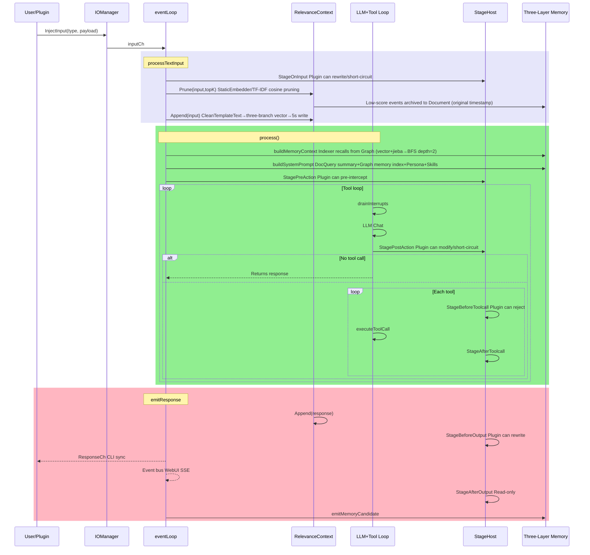
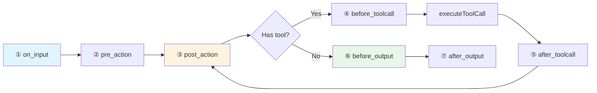

# HomeAgent

> **中文**: [README.md](./README.md)

An Agent framework designed around **separation of core domain and application domain**. The kernel enforces a zero-IO policy — all external interaction (WebUI, QQ, CLI, file operations, web search, memos, etc.) is handled by the plugin layer; the kernel performs no direct IO operations.

Combined with a **three-layer memory architecture** (Context → Document → Graph), it maintains contextual coherence across long-running single-conversation sessions through tiered storage and automated archival.

```go
homed (kernel, zero IO) ← PluginSDK → plugins (all IO capabilities)
```

## Design Principles

**Separation of Core Domain and Application Domain** — The kernel's responsibilities are limited to LLM orchestration, memory management, and knowledge retrieval; all IO capabilities (message send/receive, file read/write, network requests, hardware interaction, etc.) are implemented by plugins. This separation defines domain boundaries at the Agent framework level, with distinct responsibility scopes for the kernel and plugins.

**Three-Layer Memory Architecture** — Manages information retention in long-running agents through a tiered storage strategy:
- **Context Layer**: Pretrained word embedding / TF-IDF fallback relevance-scored event window, protects last 10 entries, maintains topK context entries
- **Document Layer**: Temporary memory with automatic cold data sinking, also supports user-initiated submissions
- **Graph Layer**: SQLite graph database, persists entity relationships and semantic memory, supports distillation pipelines to extract triples from conversations

## Architecture Diagrams

### 1. Message Processing Sequence



### 2. Stage Pipeline



### 3. Three-Layer Memory

```mermaid
flowchart TB
    subgraph C[① Context Working Window]
        RC[RelevanceContext]
        A[Append] -->|CleanTemplateText→three-branch vector| RC
        P[Prune StaticEmbedder/TF-IDF Cosine] -->|Low score original timestamp| D
        P -->|Keep| TL[timeline→chronological→system prompt]
    end
    subgraph D[② Document File Memory]
        DS[DocStore JSON+TF-IDF]
        Q1[Query summary auto-inject] -->|[Related Memory Docs]| SP
        Q2[doc_query LLM active recall] -->|Consume+delete source| DS
        Q2 -->|Original timestamp write to context| RC
        CD[FindColdDocs 72h] -->|docToTriples| G
    end
    subgraph G[③ Graph Database]
        DB[(SQLite)]
        IDX[Indexer vector+jieba→BFS depth=2] -->|[Memory Index]| SP
        MEM[memory_recall/commit/merge/purge/edit]
        SOC[person_query/set_trait]
    end
    subgraph H[④ Heartbeat Distillation]
        REORG -->|Step3 Cold docs| CD
        REORG -->|Step4 Bigram Jaccard| CONS[consolidation]
        PIPE[Pipeline regex] -->|Name/Address/Likes/Age/Job| DB
    end
    SP[System Prompt] -->|Sequential assembly| LLM
    LLM[LLM] -->|doc_query| Q2
    LLM -->|memory_recall| MEM
```

See [`assets/docs/en/ARCHITECTURE.md`](assets/docs/en/ARCHITECTURE.md) for details.

## Web Mascot

<div align="center">
  
  <p><strong>Xiaozhai</strong> — HomeAgent Web Mascot</p>
</div>

## Quick Start

```bash
make build build-cli
./build/homed -data /tmp/ha
```

```bash
# Interactive mode
./build/waiter

# Or single message
echo "Hello, remember that I like coffee" | ./build/waiter
```

API keys are configured via WebUI `http://localhost:8080` settings page, persisted in SQLite.

## Code Structure

```
cmd/homed/          Daemon entry, assembles all subsystems
cmd/waiter/         CLI client (Unix socket)
internal/
├── agent/core/     Agent core: event loop, LLM tool loop, 7-stage pipeline
├── agent/api/      LLM Provider + 8 Lua adapters
├── memory/         Three-layer memory: Graph(SQLite) / Document(JSON+TF-IDF) / Text(JSONL) + StaticEmbedder(pretrained word embedding/TF-IDF fallback) + CleanTemplateText(de-template)
├── knowledge/      Knowledge base (filesystem + TF-IDF)
├── plugin/         Plugin registry + .so/.dll dynamic loader
├── plugins/        11 built-in plugins (webui/cli/timer/cmd/mcp/clawhubadapter/agentcli/healthcheck/pluginmgr/files/cfgmgr)
├── sdk/            PluginSDK (Tool/Stage/Event three channels)
├── config/         SQLite config center
├── events/         Event bus
└── internal/lua/adapters/   8 LLM protocol adapter scripts
External plugin development: see [homeagent-sdk](https://gitcode.com/JianFeeeee/homeagent-sdk) repo, use `plugindev` toolchain, refer to Go and Lua examples in `example/`
```

## Project Status

**v0.8.0** — Core is functional, plugin system enhanced. 20+ built-in plugins. External plugin development via [homeagent-sdk](https://gitcode.com/JianFeeeee/homeagent-sdk) repo. Added input channel `NoMemory`/`Cleaner`, `ChannelDef`, plugin disable/enable system (CLI + WebUI), `plugindev` toolchain C ABI `ChannelDef` support.

## Documentation

- [Project Overview](assets/docs/en/OVERVIEW.md) | [中文](assets/docs/zh/OVERVIEW.md)
- [Technical Architecture](assets/docs/en/ARCHITECTURE.md) | [中文](assets/docs/zh/ARCHITECTURE.md)
- [Plugin Development Guide](assets/docs/en/PLUGIN_DEV.md) | [中文](assets/docs/zh/PLUGIN_DEV.md)
- [Lua Adapter](assets/docs/en/ADAPTER.md) | [中文](assets/docs/zh/ADAPTER.md)
- [Knowledge Base Demo](assets/knowledge/homeagent_architecture/content.md)

## Build

```bash
make build build-cli    # Build daemon + CLI
make test               # go test ./...
make install            # Install to system
```

Dependencies: Go 1.25+, CGo (go-sqlite3), Linux/Windows.
